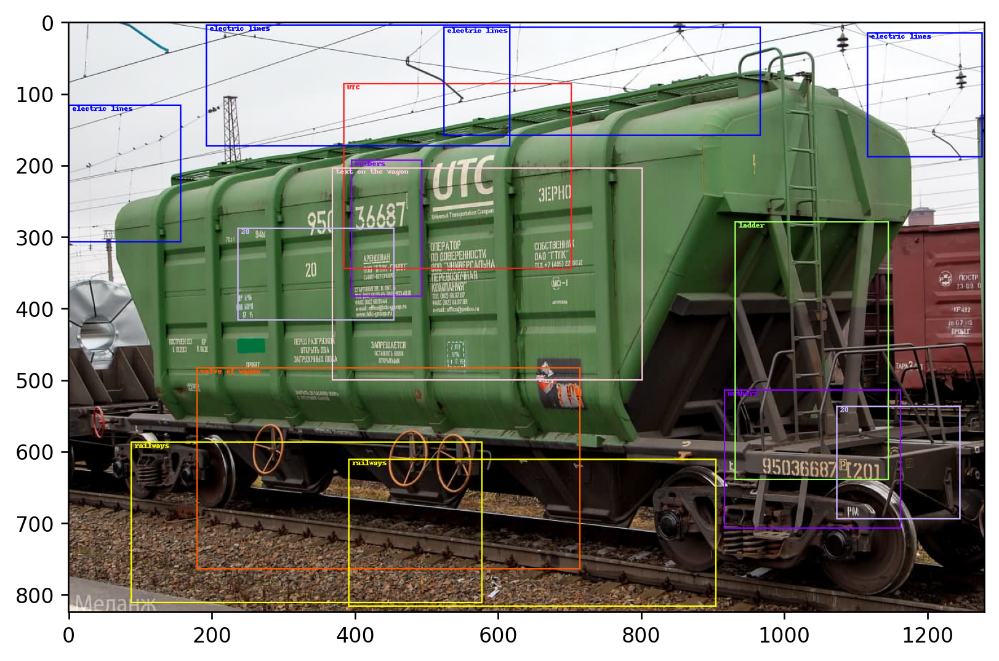
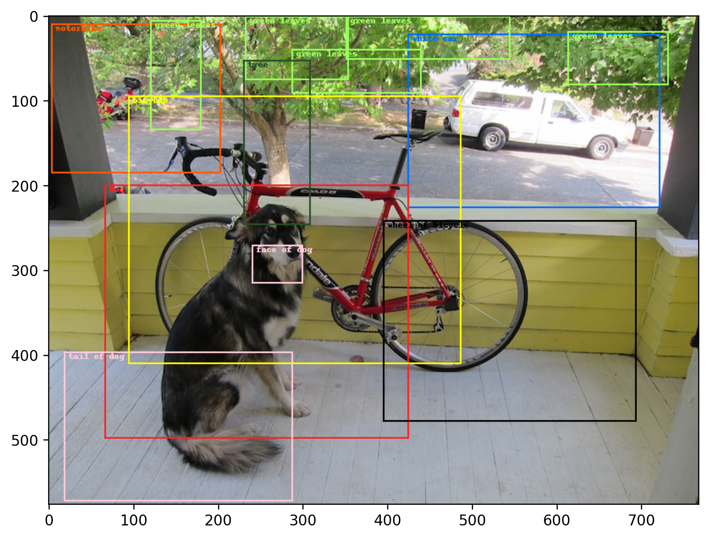

## [CLIP ODS] CLIP Object Detection & ~~Segmentation~~

This repo is about a simple add-on over [CLIP by OpenAI](https://openai.com/blog/clip/) for Unsupervised Object Detection (Zeroshot).
You can search bounding boxes of objects using NATURAL LANGUAGE UNDERSTANDING - no classes, only text.

[](https://colab.research.google.com/drive/13B9B1N_nPw1p8e5--F5MoLiXuJoKDKZN?usp=sharing)






## INSTALLING

```
pip install clip_ods
```


## Minimal Example [](https://colab.research.google.com/drive/13B9B1N_nPw1p8e5--F5MoLiXuJoKDKZN?usp=sharing)

```python
import torch
import gdown
import matplotlib.pyplot as plt
from PIL import Image
from clip_ods import clip, CLIPDetectorV0
from clip_ods.utils import get_anchor_coords

COUNT_W, COUNT_H = 13, 13

device = torch.device('cuda:0')
model, preprocess = clip.load("RN50x4", device=device)
clip_detector = CLIPDetectorV0(model, preprocess, device)

img_path = 'example5.png'
gdown.download(f'https://drive.google.com/uc?id=1nMPyWquE7U7_fuh0Rk4ZGgeWAtCFEqi8', './', quiet=True);

img = Image.open(img_path)
coords = get_anchor_coords(img, count_w=COUNT_W, count_h=COUNT_H)
anchor_features = clip_detector.get_anchor_features(img, coords)
```
```python
res_img, res, _ = clip_detector.detect_by_text(
    texts=['green leaves', 'leaves', 'foliage', 'green foliage'],
    coords=coords,
    anchor_features=anchor_features,
    img=Image.open(img_path),
    proba_thr=0.8
)
plt.figure(num=None, figsize=(8, 8), dpi=120, facecolor='w', edgecolor='k')
plt.imshow(res_img);
```

## Authors:

- [Alex Shonenkov](https://www.kaggle.com/shonenkov)
- [Sergey Shtekhin](https://www.kaggle.com/shse77)
- [Denis Karachev](https://github.com/thedenk/)

## Supported by:
- [OCRV](http://www.ocrv.ru/)
- [RZD](https://eng.rzd.ru/)


