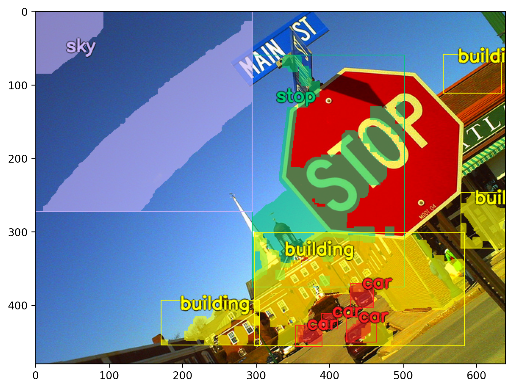
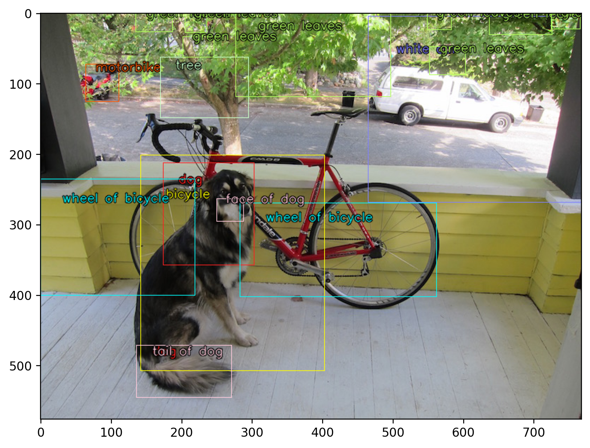
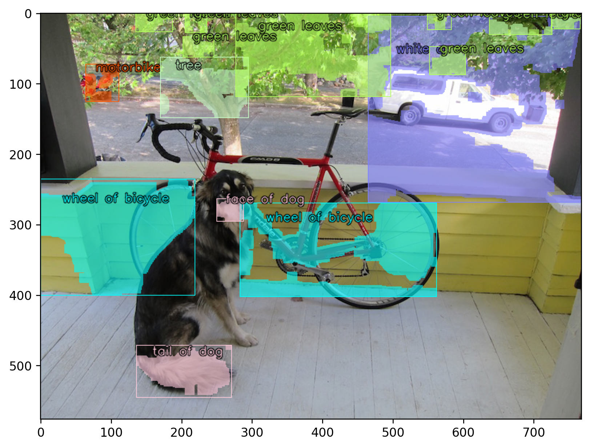
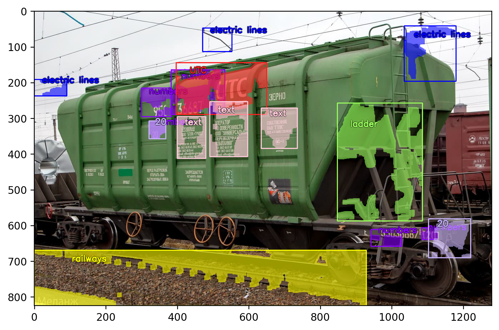

## [CLIP ODS] CLIP Object Detection & Segmentation

This repo is about a simple add-on over [CLIP by OpenAI](https://openai.com/blog/clip/) for Unsupervised Object Detection (Zeroshot).
You can search bounding boxes and some regions of objects using NATURAL LANGUAGE UNDERSTANDING - no classes, only text.

[](https://colab.research.google.com/drive/1273xNBDcbc4XGjJnnB3V8YoYU9aIcBIB?usp=sharing)







## INSTALLING

```
pip install clip_ods
```

## Minimal Examples 
- **ClipDetectionV0:** [](https://colab.research.google.com/drive/13B9B1N_nPw1p8e5--F5MoLiXuJoKDKZN?usp=sharing)
- **ClipDetectionV1 (with simple segmentation):** [](https://colab.research.google.com/drive/1273xNBDcbc4XGjJnnB3V8YoYU9aIcBIB?usp=sharing)

## V0:


## Authors:

- [Alex Shonenkov](https://www.kaggle.com/shonenkov)
- [Sergey Shtekhin](https://www.kaggle.com/shse77)
- [Denis Karachev](https://github.com/thedenk/)

## Supported by:
- [OCRV](http://www.ocrv.ru/)
- [RZD](https://eng.rzd.ru/)


